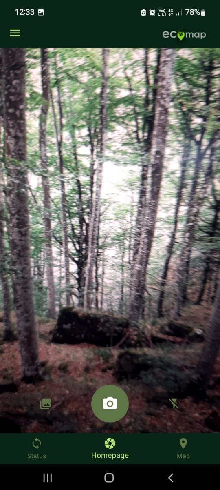
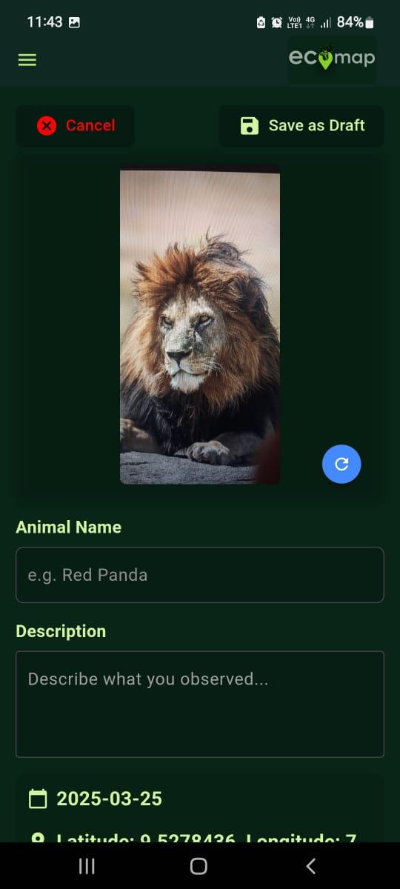
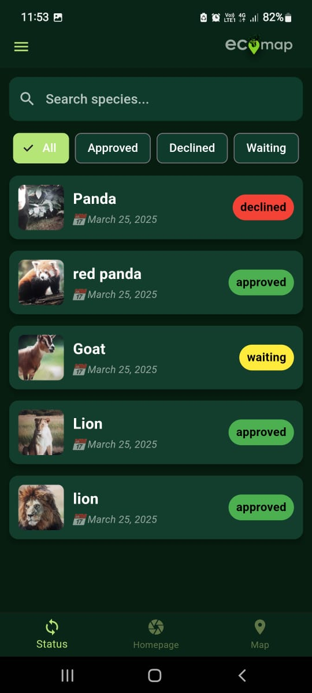
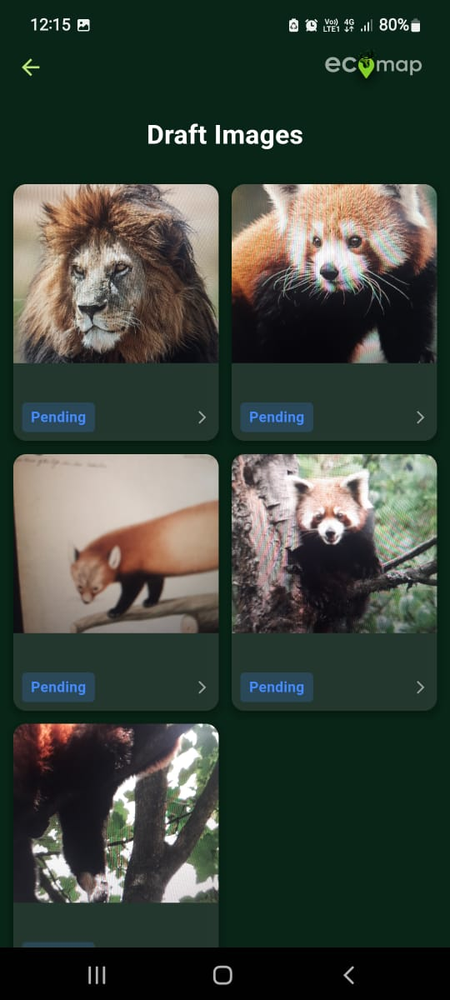
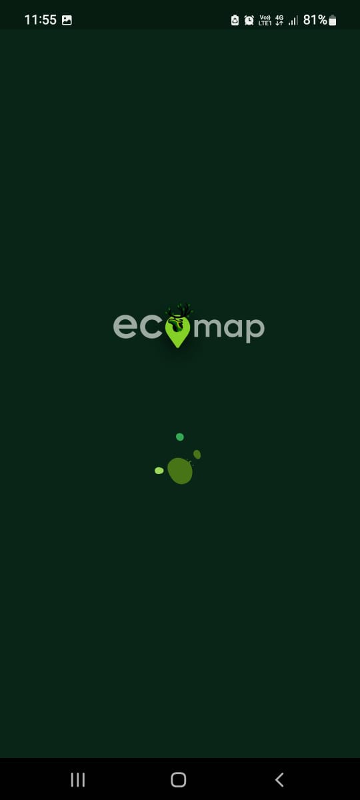
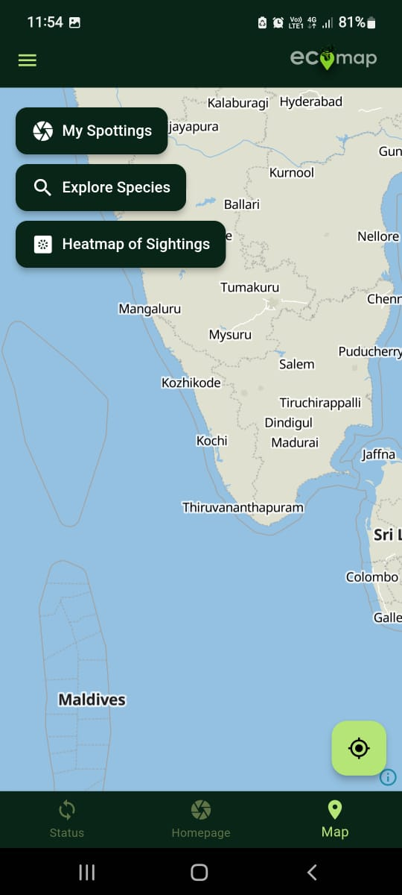
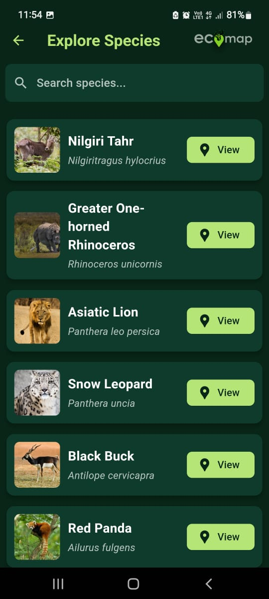
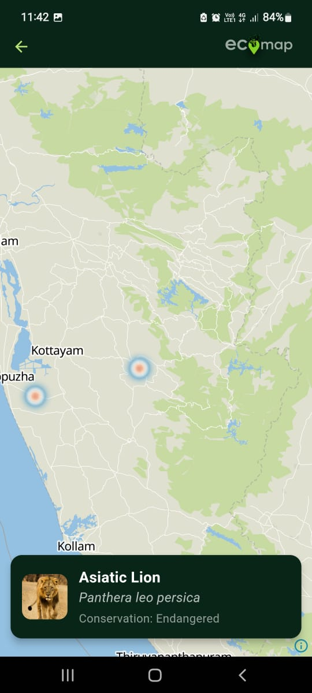

# 🌍 EcoMap – Community-Driven Biodiversity Mapping  

EcoMap is a mobile application designed to connect **nature enthusiasts, researchers, and conservationists**. Users can capture images of animals, plants, and other species with **geolocation data**. The data is reviewed by **biodiversity experts** and displayed on an **interactive heatmap**, fostering citizen science and environmental awareness.  

---

## 📱 Download EcoMap  
[⬇️ Download Latest APK](https://github.com/MhmdSalman18/Ecomap/releases/download/v1.0/Ecomap.apk)  

---

## 🚀 Features  
✅ **Capture & Geotag** – Upload images of species with location data.  
🗺 **Interactive Heatmap** – View all recorded sightings on a real-time map.  
✅ **Expert Validation** – Submissions reviewed by biodiversity specialists.  
🔄 **Offline Support** – Save drafts and upload when online.  
🤖 **AI Integration (Upcoming)** – AI-powered species recognition.  
📊 **Advanced Analytics (Upcoming)** – Gain insights into biodiversity patterns.  

---

## 🛠️ Tech Stack  
🚀 **Frontend:** Flutter (Dart)  
📍 **Maps & Geolocation:** `maplibre_gl`  
🖥 **Backend:** Node.js (Future Expansion)  
💾 **Database:** MongoDB 

---

## 📸 Screenshots  

<table align="center">
  <tr>
    <td align="center"><br><b>Home Screen</b></td>
    <td align="center"><br><b>Image Submitting Page</b></td>
     <td align="center"><br><b>Status Page</b></td>
    <td align="center"><br><b>Draft Page</b></td>
  </tr>
  <tr>
   
  </tr>
  <tr>
    <td align="center"><br><b>Splash Screen</b></td>
    <td align="center"><br><b>Map Screen</b></td>
      <td align="center"><br><b>Explore Species Page</b></td>
    <td align="center"><br><b>Explore Species Heatmap Page</b></td>
  </tr>
  <tr>
  
  </tr>
</table>

---

## 🔧 Installation & Setup  

1️⃣ **Clone the repository:**  
   ```sh
   git clone https://github.com/MhmdSalman18/Ecomap.git
   cd Ecomap
